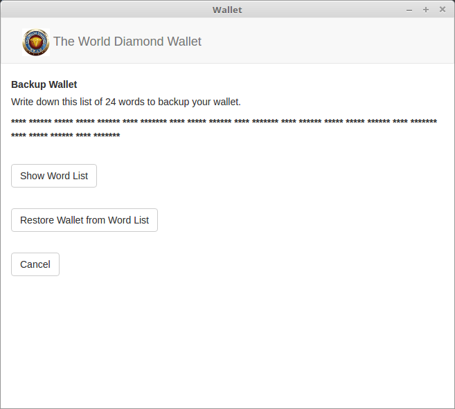

<a name="Backup">
###Backup your wallet
Go to the 'Settings' tab.  
Hit the 'Backup and Restore' button.  
Hit the 'Show Words' button to show the 24 words.  
Write the words down, and save the paper.*  

<small>*It is important to keep your backup in a secure location.</small>

