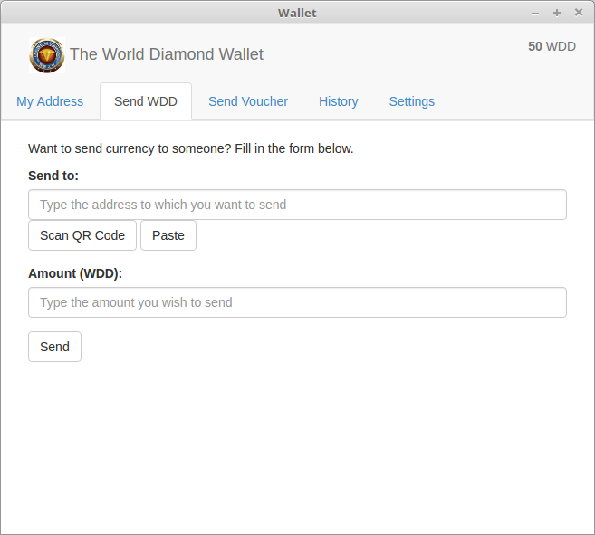
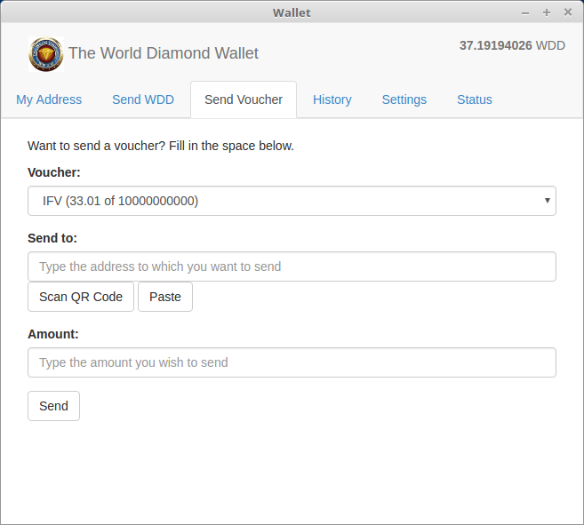

<a name="WinInstall">
###Windows Installation of WDD Wallet
Download the installer from [http://64.19.211.41/wdd/WddWalletSetup.exe](http://64.19.211.41/wdd/WddWalletSetup.exe) to your download folder.
Launch WddWalletSetup.exe, and follow the prompts. 

Note: As part of the wallet installation it will install VirtualBox.  Accept all the defaults, but when you are offered the option to run VirtualBox at the end of the installation, uncheck the box. 

The last page of the installer will offer to run Wallet.exe.  Keep the box checked and it will start the wallet automatically.

The first time it runs, it will take some time to initialize.  Please be patient.  

When it prompts to seed the chain, accept the default location.  The wallet will automatically assign you a unique address.  This is like your account number.  You receive and send using your address.

When you see your address and your QR code, you are ready to accept WDD and Vouchers.

###Verifying integrity of your Windows install download
Because of the value of crypto, some attempts have been seen to trick people into installing compromised software.  We are not aware of any attempts to do so with this wallet, howevver, we provide an MD5 and SHA256 checksum that lets you verify the installer.  Obtain the checksums from http://<domain>/wdd/checksums.txt

Use these commands in a command prompt (on Windows) to verify the checksum.  Verifying one is enough.
Replace <file> with the filename of your download.  
```certutil -hashfile <file> md5```  
```certutil -hashfile <file> sha256```

<a name="LinuxInstall">
###Linux Installation of WDD Wallet
Download the installer from  
[http://64.19.211.41/wdd/wdd-wallet-linux-x64.tar.gz](http://64.19.211.41/wdd/wdd-wallet-linux-x64.tar.gz) for 64-bit  
[http://64.19.211.41/wdd/wdd-wallet-linux-ia32.tar.gz](http://64.19.211.41/wdd/wdd-wallet-linux-ia32.tar.gz) for 32-bit  

Extract with:
```tar -xzvf <file>```  

From the newly created wddwallet folder, run:  
```sudo sh install.sh```  
You may be prompted for your password, and at the end of the install you will be asked if you want to run the wallet.

The first time the wallet runs, it will take some time to initialize.  Please be patient.  

When it prompts to seed the chain, accept the default location.  The wallet will automatically assign you a unique address.  This is like your account number.  You receive and send using your address.

When you see your address and your QR code, you are ready to accept WDD and Vouchers.

To run the wallet later:  
```wdd-wallet```

###Verifying integrity of your linux download
Because of the value of crypto, some attempts have been seen to trick people into installing compromised software.  We are not aware of any attempts to do so with this wallet, howevver, we provide an MD5 and SHA256 checksum that lets you verify the installer.  Obtain the checksums from 
http://64.19.211.41/wdd/checksums_linux.txt

Use these commands in a command prompt (on Windows) to verify the checksum.  Verifying one is enough.
Replace ```<file>``` with the filename of your download.  
```md5sum <file>```  
```sha256sum <file>```
<a name="WinBackup">
###Backup your wallet
Back up this folder*:  
```C:\Users\<your user>\Virtual Box VMs\wddwallet```

This folder can be large.  It is recommended to save to an external HD, large thumbdrive, or DVD.  

<small>*It is important to keep your backup in a secure location.</small>

<a name="LinuxBackup">
###Backup your wallet
Back up this file*:  
```~/.multichain/wdd/wallet.dat```

<small>*It is important to keep your backup in a secure location.</small>

<a name="Receiving">
###Receiving Vouchers or WDD
For others to send WDD or Assets to you, they will need your address.  

<a href="" target="_blank"></a>


You can give them the address text string which looks like this:   
`wUCS7Qy9YzoQt1Np4XEqHVDhMGnpCSECEcWKtd`  
Or let the recipient scan the QR Code with their phone.  

You can copy/paste the address or qr code from the application to an e-mail.  

<a name="SendWDD">
###Sending WDD
To send WDD to others.  

<a href="" target="_blank"></a>

Paste their address into __Send to__:   This is like their account number.  If you have their QR code, and your computer has a camera, then hit [Scan QR Code] to allow the camera to see the QR code image.  If it is a valid address, it will be recognized automatically and entered for you.

Enter the amount you wish to send, and hit [Send].

If you are connected to the internet, the WDD will be sent.  It will usually show up very quickly, but may take several minutes before it can be spent by the recipient.
<a name="SendVoucher">
###Sending a Voucher
To send a voucher.  

<a href="" target="_blank"></a>

Select the voucher you wish to send.  If the Voucher list is empty, you do not have any vouchers.

Paste the recipient's address into __Send to__:  

If you have their QR code, and your computer has a camera, then hit [Scan QR Code] to allow the camera to see the QR code image.  If it is a valid address, it will be recognized automatically and entered for you.

Enter the amount you wish to send, and hit [Send].

If you are connected to the internet, the Voucher will be sent.
<a name="History">
###Transaction History

View the transaction history of your account.

<a href="" target="_blank"></a>
<a name="Settings">
###Settings

Select your preferred language.

<a href="" target="_blank"></a>

