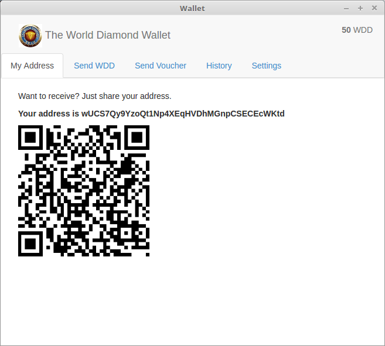

<a name="Receiving">
###Receiving Vouchers or WDD
For others to send WDD or Assets to you, they will need your address.  

You can give them the address text string which looks like this:   
`wUCS7Qy9YzoQt1Np4XEqHVDhMGnpCSECEcWKtd`  
Or let the recipient scan the QR Code with their phone.  

You can copy/paste the address or qr code from the application to an e-mail.  

