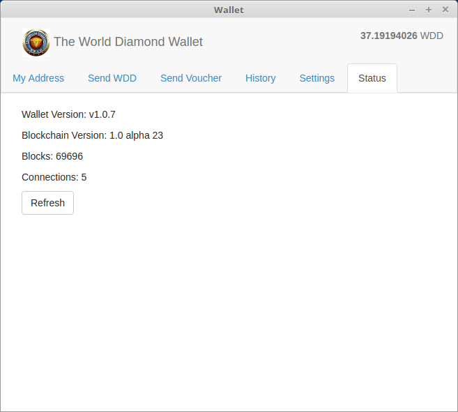

<a name="Status">
###Status
Show general status of the program and the blockchain.  

**Version** lets you know the version of the client.  

**Blockchain Version** gives you the version of the blockchain software which secures and records transactions.  

**Blocks** provides the number of blocks that your client has downloaded.  This must catch up to the current block height for new transactions to be displayed.  

**Connections** shows the number of connections your client has made to update the blockchain.  

**Refresh** lets you refresh the status information.
